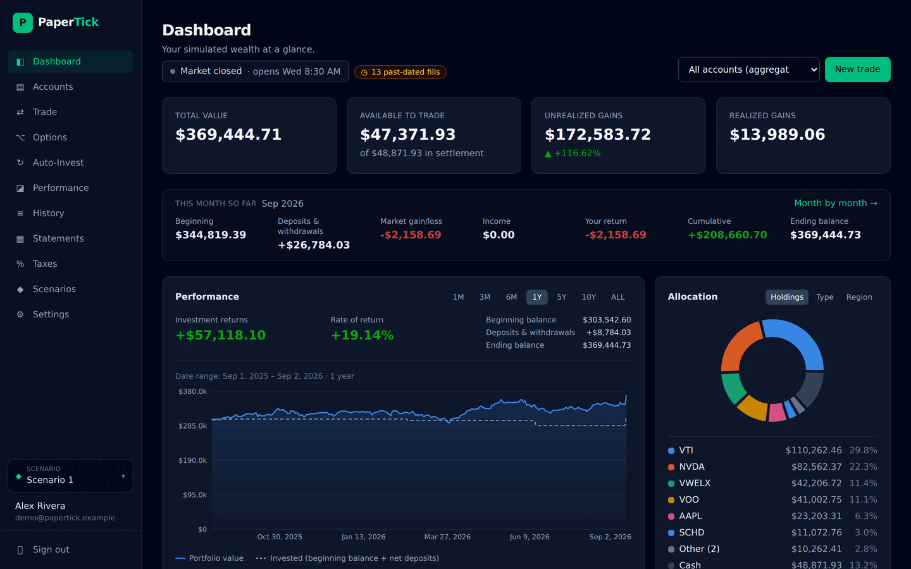
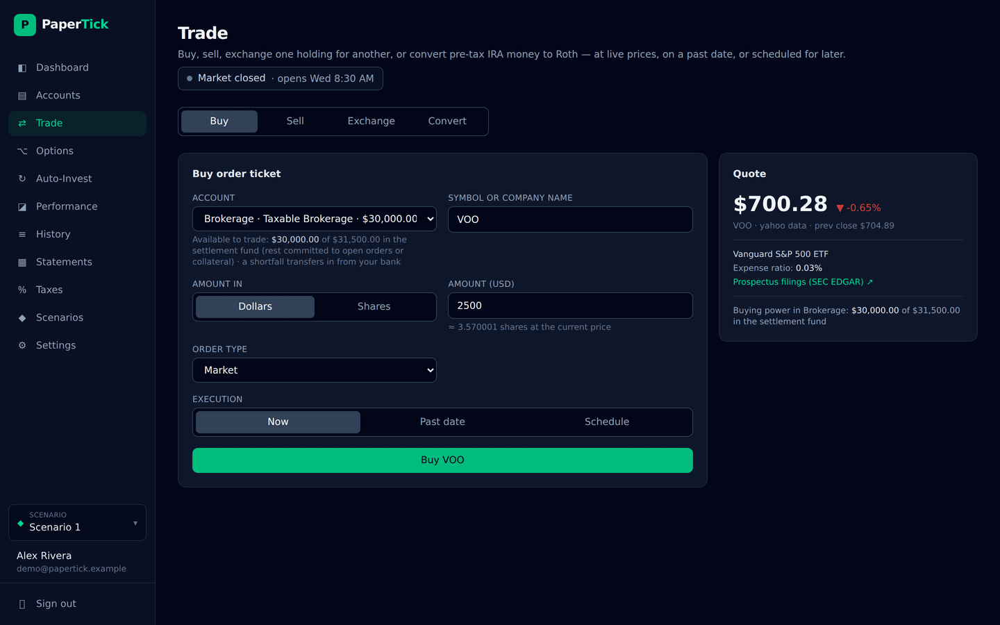
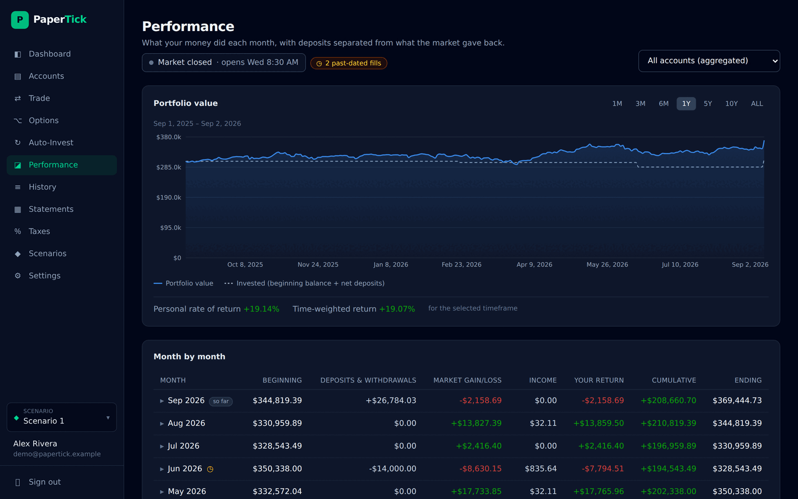
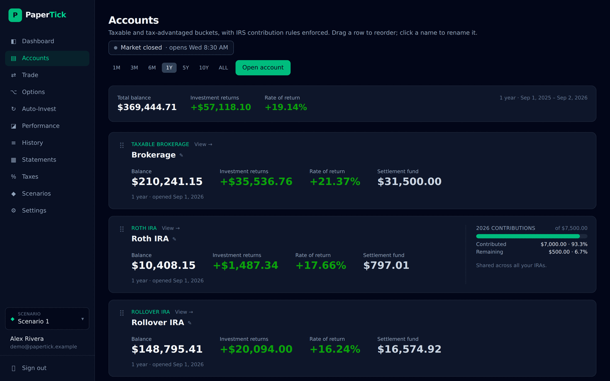
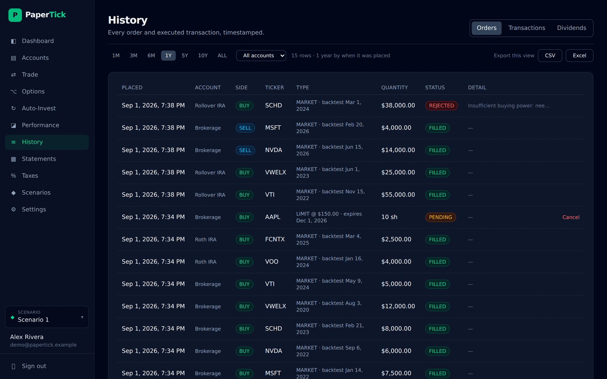

# PaperTick


**Paper trading with a real brokerage's rules.** Buy stocks, ETFs, mutual funds and
options with imaginary money at real market prices, backdate a trade to find out what
a decision three years ago would have been worth, and let a scheduler keep buying while
you're not looking. Balances, tax lots, dividends and returns are tracked to the cent in
a Postgres ledger, IRS contribution limits are enforced on the retirement buckets, and
everything the web UI can do is also a REST call — so an agent or a cron job can run a
portfolio without a browser.

It is a simulator, not a broker. No money moves, no account is ever opened anywhere. The
point is that everything *else* behaves like the real thing: the market is shut at night
and on holidays, mutual funds price once a day after the close, sales split into
short- and long-term gains, and a $500-a-month habit compounds exactly the way it would
have.



## What it does

- **Four account buckets** — taxable brokerage, Roth, Traditional and Rollover IRA, with
  annual contribution limits, age-50 catch-up, prior-year designation and rollover
  exemptions enforced as you deposit. Limits are seeded from Publication 590-A back to
  1997 — including the years before catch-up contributions existed — so an imported
  statement is checked against the limit that actually applied that year. Each autumn a
  job reconciles them against irs.gov, and stops once the new figures are recorded.
- **Real market emulation** — NYSE calendar and hours, orders queued outside them,
  mutual funds forward-priced at the daily NAV, limit orders with expiry, simulated
  commission and a slippage distribution rather than a flat fudge factor.
- **Backtesting** — place an order *as of* a past date and watch it flow into today's
  balances. Every past-dated fill is flagged wherever its numbers appear, so a return
  produced with hindsight always says so.
- **A ledger that balances** — tax lots with FIFO/LIFO/HIFO/MinTax/average-cost/specific-ID
  elections, real dividend history, stock splits applied to open lots, realized and
  unrealized gains, TWR and money-weighted return, monthly PDF statements.
- **Options** — calls, puts, covered calls and cash-secured puts, priced off the live
  underlying, with automatic exercise and assignment at expiry.
- **Scheduled investing** — recurring buys on any cadence, including a "fund to my
  contribution limit" mode, with missed runs replayed at their own day's close after an
  outage.
- **Scenarios** — independent what-if tracks. Copy your portfolio, try something reckless
  in the copy, throw it away.
- **A real API** — scoped keys, an OpenAPI spec, and no feature that is UI-only.
- **Account security you can audit** — passkeys, optional TOTP, an emailed code for a
  password sign-in from an unrecognised browser, single-use password recovery, and a
  security log that records the originating IP of every sign-in and change. Anything
  worth knowing about is emailed too.

Full inventory: [docs/features.md](docs/features.md).

<table>
<tr>
<td width="50%"><a href="docs/img/trade.png"></a><br><sub><b>Trade</b> — live quote, expense ratio, buying power, and the choice of now / a past date / a schedule.</sub></td>
<td width="50%"><a href="docs/img/performance.png"></a><br><sub><b>Performance</b> — every month's beginning balance, flows, market movement and income, balancing to the cent.</sub></td>
</tr>
<tr>
<td><a href="docs/img/accounts.png"></a><br><sub><b>Accounts</b> — buckets side by side, with this year's IRA contribution room.</sub></td>
<td><a href="docs/img/history.png"></a><br><sub><b>History</b> — every order and fill, timestamped, exportable to CSV or Excel.</sub></td>
</tr>
</table>

<sub>Screenshots are a seeded demo account, not anyone's real portfolio. More:
[options chain](docs/img/options.png) · [tax report](docs/img/taxes.png).</sub>

## Stack

| Layer | Technology |
|---|---|
| Frontend | Next.js 16 (App Router) · React 19 · Tailwind 4 · Recharts · TypeScript 7 |
| Backend | Python 3.14 · FastAPI · SQLAlchemy 2 · Pydantic v2 |
| Database | PostgreSQL 18 — the ledger of record, with row-level locking on every fill |
| Queue & cache | Redis 8 + Celery (worker and beat) |
| Market data | Polygon · Tiingo · Alpaca · Yahoo · Nasdaq, with an offline synthetic fallback |
| Infra | Docker Compose — rootless-friendly, no privileged ports, no host toolchain |

No UI component library, no CSS-in-JS, no state manager, no data-fetching library: the
API client is plain `fetch` and the components are plain React. Every version is pinned
exactly — the full inventory is in [docs/dependencies.md](docs/dependencies.md).

## Requirements

| | |
|---|---|
| **Docker** | Engine with the Compose v2 plugin — check with `docker compose version`. Rootless Docker is fine; nothing needs a privileged port. Podman works too, with two caveats — see [docs/podman.md](docs/podman.md). |
| **RAM** | 4 GB comfortably. It will run in 2 GB. |
| **Disk** | ~1.5 GB of images, a few GB more for Docker's build cache, plus your data (a few hundred MB after years of activity). |
| **A free port** | 3000 by default, changed with `FRONTEND_PORT`. |
| **Outbound HTTPS** | For market data. The default source is Yahoo Finance and needs no account. Set `MARKET_DATA_PROVIDER=synthetic` to run fully offline on invented prices. |

Nothing else. Python, Node, Postgres and Redis all live in containers — there is no
host toolchain to install and no version to match.

For a deployment other people can reach, you also want a TLS reverse proxy in front
(see [docs/reverse-proxy.md](docs/reverse-proxy.md)) and an SMTP relay for verification
email.

## Install

```bash
git clone https://github.com/robertclemens/papertick.git
cd papertick
cp .env.example .env
```

Open `.env` and fill in the three secrets at the top:

```bash
# generate one of each and paste them in
openssl rand -hex 24    # POSTGRES_PASSWORD
openssl rand -hex 32    # REDIS_PASSWORD
openssl rand -hex 48    # SECRET_KEY
```

Use those generators as given. Both passwords are interpolated into connection URLs, so
a value containing `@ : / ? #` or `+` produces a broken URL and a backend that never
becomes healthy — which is why they are hex and not `openssl rand -base64`.

Then:

```bash
docker compose up -d --build
```

First build takes a few minutes. When it settles:

- Web UI — <http://localhost:3000>
- API docs — <http://localhost:3000/api/docs>
- Health — <http://localhost:3000/healthz>

Sign up in the UI (password: 12+ characters, letters and digits), open an account,
deposit some cash, and buy something. `docker compose logs -f backend` shows the schema
being created on first boot; nothing else starts until that finishes.

Everything is served through the `frontend` container. The backend port is deliberately
never published — `frontend` proxies `/api` and `/healthz` to it over the internal
Docker network, which is also what makes the session cookies first-party.

### Going to production

Five settings in `.env`, then rebuild:

```dotenv
ENV=production                             # email verification, no anonymous API docs
COOKIE_SECURE=true                         # you are behind TLS
FRONTEND_ORIGIN=https://papertick.example  # scheme + host, never a path
ALLOWED_HOSTS=backend,127.0.0.1            # Host values the BACKEND sees, not your domain
SMTP_HOST=smtp.example.com                 # + SMTP_USER / SMTP_PASSWORD / SMTP_FROM
TRUST_PROXY_HEADERS=true                   # a reverse proxy sets X-Forwarded-For
TRUSTED_PROXY_CIDRS=172.16.0.0/12          # ...and the backend may believe it
```

```bash
docker compose up -d --build
```

Neither container terminates TLS, so put a reverse proxy in front of `frontend` —
[docs/reverse-proxy.md](docs/reverse-proxy.md) has working Caddy, nginx and Apache
configs for both a dedicated hostname and a `/subfolder` deployment. Leave
`DEMO_MODE=false`, and generate secrets fresh for the deployment rather than reusing
the ones from your laptop.

`SMTP_HOST` is not optional in production: password recovery, the new-device code
and every security notice are delivered by email, and without a relay they cannot
be sent at all.

The last two settings are what makes the security log record the visitor's address
rather than the frontend container's. Set them **only** with a proxy actually in
front — exposing `frontend` directly and turning them on lets any caller name its
own IP. [docs/reverse-proxy.md](docs/reverse-proxy.md#recording-the-clients-ip-address)
explains both shapes.

## Using it from a script or an agent

The API is reached through the same origin as the web UI. Create a key under
**Settings → API keys** — it is shown once, stored as a hash, and carries `read` and/or
`trade`.

```bash
export PT_KEY=ptk_...
export PT_URL=http://localhost:3000

# what am I worth?
curl -s -H "Authorization: Bearer $PT_KEY" $PT_URL/api/v1/portfolio/summary

# buy $500 of VOO at the current price
curl -s -X POST -H "Authorization: Bearer $PT_KEY" -H "Content-Type: application/json" \
  -d '{"account_id":"<uuid>","ticker":"VOO","side":"BUY","quantity_type":"DOLLARS","quantity":"500"}' \
  $PT_URL/api/v1/orders

# ...or $500 of it on the 1st of every month, forever
curl -s -X POST -H "Authorization: Bearer $PT_KEY" -H "Content-Type: application/json" \
  -d '{"account_id":"<uuid>","ticker":"VOO","amount":"500","cadence":"MONTHLY","day_of_month":1}' \
  $PT_URL/api/v1/schedules
```

Three things worth knowing before you script against it: amounts are decimals sent as
**strings**, a fill is **not always immediate** (outside market hours an order comes back
`SCHEDULED`), and administration — creating accounts, managing scenarios, rotating
credentials — needs a signed-in session rather than a key. Set the accounts up in the UI,
then let the agent work inside them.

The live spec is at `/api/openapi.json`, browsable at `/api/docs`. The full guide,
including the endpoint map and scenario headers, is
[docs/api.md](docs/api.md).

## Backup

Everything durable is in Postgres — holdings, orders, tax lots, dividends, statement PDFs,
API keys, passkeys. Redis holds only cached prices, rate-limit counters, in-flight login
challenges and the Celery queue, and rebuilds itself from nothing on restart. So a backup
is one file, plus your `.env`.

```bash
docker compose exec -T db pg_dump -U papertick -d papertick --format=custom \
  > papertick-$(date +%F).dump
```

That is safe to run against a live stack — `pg_dump` takes a consistent snapshot without
locking anyone out. Keep `.env` alongside it: without `SECRET_KEY` the restored database
still works, but every session, enrolled authenticator app and signed scenario export is
invalidated.

A nightly cron on the host:

```cron
15 3 * * * cd /srv/papertick && docker compose exec -T db pg_dump -U papertick -d papertick --format=custom > /backups/papertick-$(date +\%F).dump
```

## Restore

**Into a fresh install**, before the app has ever started — the clean path, and the one
to prefer:

```bash
docker compose up -d db                        # database only
docker compose exec -T db pg_restore -U papertick -d papertick \
  --no-owner --role=papertick < papertick-2026-09-01.dump
docker compose up -d --build                   # now bring up everything else
```

**Into an install that has already run** — the app has created its own empty schema, so
give it a genuinely empty database first rather than restoring on top:

```bash
docker compose stop backend worker beat frontend
docker compose exec -T db psql -U papertick -d postgres \
  -c 'DROP DATABASE papertick' -c 'CREATE DATABASE papertick OWNER papertick'
docker compose exec -T db pg_restore -U papertick -d papertick \
  --no-owner --role=papertick < papertick-2026-09-01.dump
docker compose start backend worker beat frontend
```

Either way, `pg_restore` should finish silently. Check the result with
`curl -s localhost:3000/healthz` and by signing in — your existing password still works,
and so do passkeys, as long as the hostname has not changed.

## Moving to another server

Same as a restore, with the old server's `.env` carried over.

```bash
# 1. on the OLD server — take the dump
docker compose exec -T db pg_dump -U papertick -d papertick --format=custom > papertick.dump

# 2. on the NEW server — clone into an empty directory
git clone https://github.com/robertclemens/papertick.git /srv/papertick

# 3. from the old server — send the dump and the .env across
scp papertick.dump .env newhost:/srv/papertick/

# 4. on the NEW server — adjust .env if the address changed:
#    FRONTEND_ORIGIN, FRONTEND_PORT, BASE_PATH
#    (ALLOWED_HOSTS is internal — it does not change with the public address)
cd /srv/papertick

# 5. restore into the empty database, then start everything
docker compose up -d db
docker compose exec -T db pg_restore -U papertick -d papertick \
  --no-owner --role=papertick < papertick.dump
docker compose up -d --build
```

Clone before you copy the files across — `git clone` refuses a directory that already
has something in it.

**Keep the same `SECRET_KEY`.** It signs sessions and derives the key that decrypts
enrolled TOTP secrets, so a new one silently locks every authenticator app out of its
account and invalidates existing scenario exports. It is in the `.env` you copied — just
don't regenerate it.

`POSTGRES_PASSWORD` and `REDIS_PASSWORD` are a different matter: they only have to agree
with the containers on the new host, so you may keep them or generate fresh ones. The
dump carries database objects, not roles.

Two things that do not travel:

- **Passkeys are bound to a hostname.** Move to a different domain and existing passkeys
  stop being offered; passwords and authenticator apps are unaffected. Re-register
  passkeys on the new address, then remove the stale ones under Settings.
- **Redis is not migrated**, and does not need to be. Rate-limit counters, login lockouts
  and cached prices rebuild themselves. Anyone mid-login when you cut over just logs in
  again.

> **Running both stacks on one Docker daemon?** The Postgres volume is pinned to the
> fixed name `papertick_pgdata_pg18` in `docker-compose.yml`, so a second copy of the
> project on the same daemon would mount the *same* volume as the first, whatever you
> call the project. Give the new one a different `name:` under `volumes:` before the
> first `up`, or run it on a separate daemon or host.

Once the new server checks out, stop the old one (`docker compose down`) but keep its
volume for a while. `docker compose down -v` is the one that deletes data.

## Upgrading

```bash
git pull
diff .env.example .env      # see what's new and worth setting
docker compose up -d --build
```

Schema migrations run automatically at backend start and are forward-only, so take a dump
first. Always pass `--build`: frontend config is baked in at image build time and a plain
restart won't pick it up.

Dependency bumps are automated by [`upgrade.sh`](upgrade.sh) behind a test gate that rolls
back on failure. That, and Postgres major-version upgrades (which need a manual dump and
reload), are in [docs/upgrading.md](docs/upgrading.md).

## Development

```bash
# backend tests — sqlite and synthetic prices, no services needed
cd backend && python3 -m venv .venv && .venv/bin/pip install -r requirements-dev.txt
.venv/bin/python -m pytest tests/ -q

# frontend, against a backend on localhost:8000
cd frontend && npm install && npm run dev
```

Compose does not publish the backend's port, so either run
`uvicorn app.main:app --reload` yourself or add
`ports: ["127.0.0.1:8000:8000"]` to the `backend` service in a
`docker-compose.override.yml` while you work.

The six services are `frontend` (Next.js, the only published port), `backend` (FastAPI),
`worker` and `beat` (Celery), `db` (Postgres 18) and `redis` (Redis 8). Schema and seed
data are created on backend start by `backend/app/init_db.py`.

## Documentation

| | |
|---|---|
| [Features in detail](docs/features.md) | What each capability actually does |
| [The REST API](docs/api.md) | Auth, scopes, scenarios, endpoint map, worked examples |
| [Market data](docs/market-data.md) | Providers, the price-convention rules, caching, what triggers a fetch |
| [Accounting, tax and performance](docs/accounting.md) | Tax lots, IRA mechanics, how returns are computed |
| [Authentication and security](docs/auth-and-security.md) | Passkeys, MFA, device verification, password recovery, the security log |
| [Reverse proxy](docs/reverse-proxy.md) | Caddy, nginx and Apache configs; sub-folder deployments; recording client IPs |
| [Running on Podman](docs/podman.md) | Rootless Podman, and the two places it differs from Docker |
| [Upgrading](docs/upgrading.md) | `upgrade.sh`, dependency policy, Postgres major versions |
| [Dependencies](docs/dependencies.md) | Every pinned package and image, and what it is for |

Configuration is documented inline in [`.env.example`](.env.example).

## License

[MIT](LICENSE).

## Contributing

Issues and pull requests welcome. For anything non-trivial, open an issue first to talk
through the approach. Run `cd backend && .venv/bin/python -m pytest tests/ -q` before
submitting.
